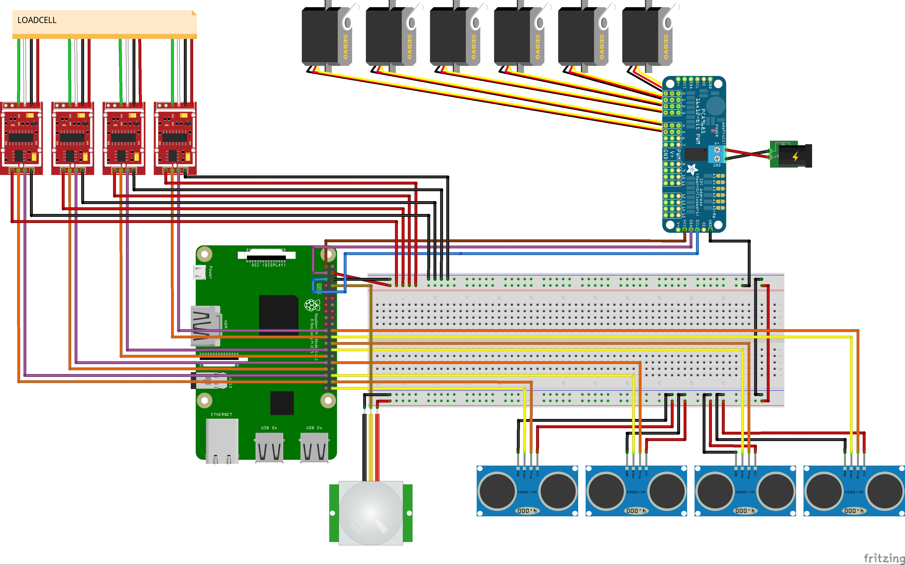

# WAISTE

## Deskripsi
Waste Management Wisely adalah bak sampah pintar sebagai solusi terkini untuk manajemen sampah yang efisien. Melalui penggunaan kamera web dan kecerdasan buatan (AI), produk ini secara otomatis mendeteksi dan mengklasifikasikan jenis sampah menjadi kertas, logam, plastik, dan lainnya. Produk ini juga dilengkapi dengan sensor loadcell untuk mengukur berat sampah dan sensor ultrasonik untuk memantau kapasitas. Saat penuh, produk ini mengirim notifikasi otomatis kepada petugas kebersihan. Bak Sampah Pintar kami adalah solusi modern untuk manajemen sampah yang ramah lingkungan.

## Requirements
- Python 3.7 atau versi yang lebih tinggi
- Raspberry Pi OS (Raspbian) atau sistem operasi serupa
- [Adafruit CircuitPython ServoKit](https://circuitpython.readthedocs.io/projects/servokit/en/latest/index.html)
- [gpiozero](https://gpiozero.readthedocs.io/en/stable/)
- [Google Cloud AI Platform Python Client](https://pypi.org/project/google-cloud-aiplatform/)
- [hx711](https://pypi.org/project/hx711/)

## Wiring Diagram

## Ubidots Dashboard

## Android Application

    
    
    
    
    
    

